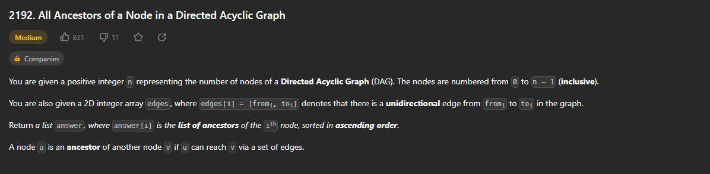
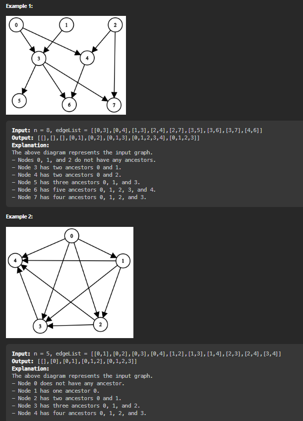
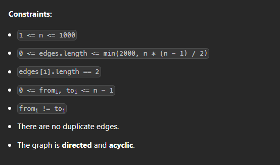

# Página de acesso ao exercício
[All Ancestors of a Node in a Directed Acyclic Graph](https://leetcode.com/problems/all-ancestors-of-a-node-in-a-directed-acyclic-graph/description/) 
# Explicação

# Exemplos

# Restrições

